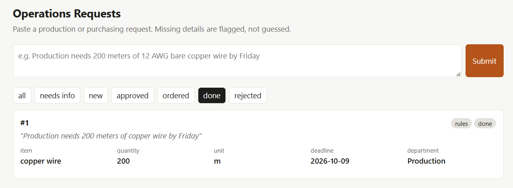

# Purchase Request Tracker

Purchase requests at a plant often show up as one-line messages like
"Production needs 200 meters of copper wire by Friday", or worse, "need more wire asap".

This app reads a request, pulls out the item, quantity, unit, deadline and
department, and flags anything that's missing instead of guessing. If details
are missing, it writes the follow-up question to send back. Every request is
saved and tracked: `needs_info → new → approved → ordered → done`.



Built with Python, FastAPI, SQLite and Pydantic. Claude is optional.

## Running it

```bash
pip install -r requirements.txt
uvicorn app.main:app --reload
```

Once it's running, open `localhost:8000` in your browser for the dashboard, or `localhost:8000/docs` for the API docs.

By default it uses simple regex rules, so it works offline. If `ANTHROPIC_API_KEY`
is set, it uses Claude for extraction instead and falls back to the rules if the
API call fails.

```bash
pytest                    # tests
python -m eval.run_eval   # accuracy on 24 labeled sample requests
```

## How it works

- `app/extract.py` holds the rules extractor, the Claude extractor and the follow-up questions
- `app/main.py` has the API and the status rules (invalid moves like `new → done` are rejected)
- `app/db.py` stores requests in SQLite, along with a history of status changes
- `app/dashboard.html` is the dashboard page

A few choices I made on purpose:
- A missing deadline is better than a wrong one, so "ASAP" or "end of next week" stays blank and gets flagged.
- Claude's output has to match a fixed schema and is checked again before it's saved.
- Bad input (empty text, negative or infinite quantities, very long fields) gets a 422 error.

## Accuracy

`eval/samples.jsonl` has 24 sample requests I labeled by hand, ranging from clean
ones to messy emails to vague ones.

With the rules extractor, 15 of 24 have every field correct, and when a detail
is genuinely missing, it leaves it blank 25 of 26 times. Most misses are phrasings
with no unit ("6 barcode scanners") or units it doesn't know ("2 pallets"). That's
where Claude should do better. I haven't measured the Claude version yet.

Running the eval also caught a bug: "need **it** today" was being tagged as the
**IT** department. It now only matches uppercase "IT", and a test covers it.

## Limitations

- There's no login, so it's for local use only.
- A request with several items in it is treated as one item.
- With an API key set, request text is sent to Anthropic.

Next steps I'd like to try: reading requests from an Outlook inbox or SharePoint
list through Microsoft Graph, and sending Teams notifications when a request
needs more info.
